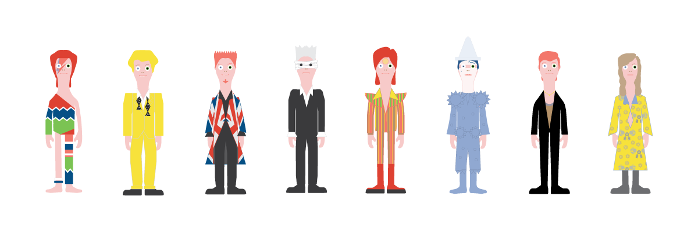

### Little Wonder: Exploring David Bowie's lyrics with Python, Watson & Bluemix
 
 
 
From 'Space Oddity' to 'Blackstar', David Bowie inspired us with his diverse personas. What can IBM Watson reveal about those iconic personalities through natural language analysis? That's the mission of 'Ziggy' a little Python app that builds a database of songs, and digs into the style and tone of writing within them. In this session, we'll see how Ziggy works, discuss use cases for the technology, compare outputs, and think about future iterations.

Reference:

http://blog.danwin.com/examples-of-web-scraping-in-python-3-x-for-data-journalists/

### Getting Started

#### Application Requirements
* Python 2.7.11

##### (Mostly) Local Development

1. Clone or download this repo onto your machine.
1. Install [application requirements](application-requirements) as needed.
1. Open application directory in your terminal and run
    `pip install -r ./requirements.txt`
1. This application cannot run without access to the Watson personality insights service.  At a minimum, environment variables with valid credential for that must be present to run the app locally.  To run this code unmodified also requires a Cloudant database instance as well as Twitter OAuth credentials.
    * Following the example below create two environment variables, substituting correct values from your Twitter and your Bluemix services :
    * `export VCAP_SERVICES='{"cloudantNoSQLDB":[{"name" : "someName","label" : "cloudantNoSQLDB","plan" : "Shared","credentials" : {"username" : "usernamegoeshere","password" : "mypassword","host" : "thehost","port" : 443,"url" : "the host"}}],"personality_insights":[{"credentials":{"password":"password","url":"url","username":"someusername"},"label":"personality_insights","name":"some name","plan":"tiered"}]}'`
    * `export TWITTER_CREDS='{"access_key": "my key", "access_secret": "my secret", "consumer_key": "my consumer key", "consumer_secret": "my consumer secret"}'`
1. Run `python ./server.py` to start your server.
1. Open a browser to [http://127.0.0.1:5000/](http://127.0.0.1:5000/)

##### Deploy to Bluemix

1. Create services in your Bluemix org and space that will align with the services expected in `manifest.yml`.
    * `cf create-service cloudantNoSQLDB Shared cloudant_ziggy`
    * `cf create-service personality_insights tiered insights_ziggy`

##### ToDo: Document needed lyrics database...  Probably can't include ziggy-scrape repo if this is made public.

##### API routes

*  `/api/personas`  will return a JSON object listing personas and the albums that have been assigned to them.
*  `/api/persona/<NAME>` will send a concatenated string containing the lyrics from every song in every album for the passed persona to the Watson Personality Insights service and return the calculated profile for that persona as a JSON object
* `/api/twitter/<TWITTER HANDLE>` will pull the most recent 3200 tweets from the passed twitter handle and calculate a Watson personality profile from them.  The Euclidean distance for this profile will be calculated for each of the personas and a JSON object will be returned containing a summary of each persona with the distance along with the Twitter profile's summary.

